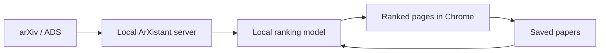

  

<h1 align="center">ArXistant</h1>

  <strong>A private, personalized assistant for keeping up with arXiv astronomy papers.</strong>

  <a href="https://jyshangguan.github.io/ArXistant/"><strong>Read the documentation →</strong></a>

ArXistant fetches new `astro-ph` submissions, learns from the papers you save,
and presents a ranked daily reading list in Chrome. The database, model, and
personal preferences remain on your computer.

## Highlights

- **Personalized daily ranking** — scores new and recent astronomy papers using
  a local TF-IDF and logistic-regression model.
- **Learns from your library** — saved papers improve future recommendations;
  editable positive and negative keywords provide direct control.
- **Focused reading interface** — browse ranked papers with collapsible
  abstracts and save useful papers with one click.
- **Local paper database** — search saved papers, maintain notes, and remove
  records through a browser interface.
- **arXiv and ADS search** — find and save papers without leaving ArXistant.
- **Publication management** — import your publications from a SciX/ADS library
  with duplicate detection.
- **Chrome reminders** — choose multiple reminder times, skip weekends, and
  automatically refresh the daily list once per day.
- **Local-first operation** — a lightweight server runs on `localhost`; there is
  no hosted ArXistant account or remote personal database.

## Documentation

Browse the complete documentation at
**[jyshangguan.github.io/ArXistant](https://jyshangguan.github.io/ArXistant/)**.

- [Installation](docs/installation.md) — macOS, Debian/Ubuntu, Windows/manual
  setup, migration, updates, and removal.
- [User guide](docs/user-guide.md) — daily workflow, reminders, saved papers,
  search, publications, and ML controls.
- [How ArXistant works](docs/how-it-works.md) — architecture, ranking pipeline,
  local data, background refresh, and project structure.

## At a glance

ArXistant is currently at version **0.1.1**. The Chrome extension is loaded as
an unpacked extension. macOS has a bundled launcher, and Debian/Ubuntu has an
experimental `.deb` package with a systemd user service.

## License

MIT
