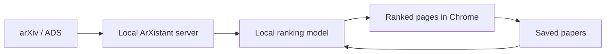

  

<h1 align="center">ArXistant</h1>

  <strong>A private, personalized assistant for keeping up with arXiv astronomy papers.</strong>

  <a href="https://jyshangguan.github.io/ArXistant/"><strong>Read the documentation →</strong></a>

ArXistant fetches new `astro-ph` submissions, learns from the papers you save,
and presents a ranked daily reading list in Chrome. The database, model, and
personal preferences remain on your computer.

## Highlights

- **Personalized daily ranking** — scores new and recent astronomy papers using
  a local TF-IDF and logistic-regression model.
- **Learns from your library** — saved papers improve future recommendations;
  editable positive and negative keywords provide direct control.
- **Focused reading interface** — browse ranked papers (arXiv ID before each
  title, titles linking to AlphaXiv) with collapsible abstracts and one-click
  save, tag, and chat actions.
- **Paper reading helper** — open one or more papers as tabs and chat with an
  LLM grounded in their full text: streamed answers with highlighted evidence
  quotes, your own highlights and notes, local PDF drag-and-drop, and an
  assistant that can search your library, Semantic Scholar, the citation
  graph, and the web.
- **Voice digest of the daily list** — a 🔊 Listen button on the Daily and
  Recent pages reads the top-ranked papers aloud: each paper is announced
  ("Paper N, title, by first author") and then its LLM-written digest is
  read, batch by batch, with a choice of man / woman / system-default voice,
  batch size, and rate.
- **Tags for saved papers** — organize your library with tags, filter the
  Saved Papers page by them, and tag papers straight from the Daily, Recent,
  or Search pages.
- **Local paper database** — search saved papers, maintain notes, and remove
  records through a browser interface.
- **ADS / SciX search** — find papers (fielded queries like
  `first_author:Greene author:Ho year:2005`) and save, tag, or open them in
  Chat without leaving ArXistant, with automatic retries when a source is slow
  or rate-limited.
- **SciXplorer integration** — a small ArXistant panel on
  [scixplorer.org](https://scixplorer.org/) paper pages shows the abstract,
  saves the paper, and opens it in Chat; journal-only papers are stored by
  bibcode with the same notes/tags/highlights, and the ADS token can be set
  right from the extension's Settings page.
- **Publication management** — import your publications from a SciX/ADS library
  with duplicate detection.
- **Chrome reminders** — choose multiple reminder times, skip weekends, and
  automatically refresh the daily list once per day; every setting lives on
  one folded-sections settings page (server, reminders, retraining, cloud
  sync, LLM, voice reading, debug).
- **Local-first operation** — a lightweight server runs on `localhost`; there is
  no hosted ArXistant account or remote personal database.
- **Optional cloud sync** — mirror your paper database to Nutstore (坚果云) over
  WebDAV and share it across devices.

## Documentation

Browse the complete documentation at
**[jyshangguan.github.io/ArXistant](https://jyshangguan.github.io/ArXistant/)**.

- [Installation](docs/installation.md) — macOS, Debian/Ubuntu, Windows/manual
  setup, Android, migration, updates, and removal.
- [User guide](docs/user-guide.md) — daily workflow, reminders, saved papers
  and tags, chat reading helper, search, publications, and ML controls.
- [How ArXistant works](docs/how-it-works.md) — architecture, ranking pipeline,
  local data, background refresh, and project structure.
- [Android app](docs/android.md) — run ArXistant standalone on a phone (arXiv
  fetch, ML ranking, and Nutstore sync, no server). Download the signed APK from
  the [latest release](https://github.com/jyshangguan/ArXistant/releases/latest);
  the app can also check for and install updates itself.

## At a glance

ArXistant is currently at version **0.3.2**. The Chrome extension is loaded as
an unpacked extension. macOS has a bundled launcher, and Debian/Ubuntu has an
experimental `.deb` package with a systemd user service. A standalone **Android
app (v0.3.2)** runs the full pipeline on the phone via Chaquopy.

## License

MIT
