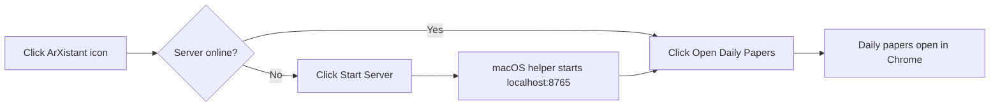

<p align="center">
  
</p>

<h1 align="center">ArXistant</h1>

<p align="center">
  <strong>Personalized arXiv Daily Paper Ranker + Local Paper Database + Publication Manager</strong>
</p>

<p align="center"><strong>Version 0.1.0</strong></p>

---

## What it does

- Fetches daily and recent arXiv astro-ph papers and ranks them for you.
- Learns your interests from saved papers using a local ML model.
- Lets you save, search, annotate, and remove papers in a local database.
- Provides editable positive and negative ranking keywords with model diagnostics.
- Imports your publications from SciX/ADS and avoids duplicate records.
- Sends configurable Chrome reminders and refreshes papers at the first daily reminder.

---

## How to use ArXistant (Chrome Extension)

The **Chrome extension** is the primary way to use ArXistant. Install it once, then everything is one click away.

### 1. Prepare ArXistant

```bash
git clone https://github.com/jyshangguan/ArXistant.git
cd ArXistant
python3 -m pip install --user numpy scikit-learn
```

On Windows, use `py` instead of `python3` if that is how Python is installed.
The bundled macOS launcher discovers the repository location automatically.

### 2. Load the extension in Chrome

1. Enter `chrome://extensions/` in Chrome's address bar.
2. Enable **Developer mode** in the upper-right corner.
3. Click **Load unpacked**.
4. In the folder chooser, select the `chrome-extension` directory itself—not
   the repository root and not an individual file.
5. Confirm that **ArXistant Daily Reminder** appears without an error badge.
6. Optional: open Chrome's Extensions menu (the puzzle-piece icon) and pin
   ArXistant so its red **A** icon remains visible in the toolbar.

```text
ArXistant/                 ← do not select this level
└── chrome-extension/      ← select this folder in “Load unpacked”
    ├── manifest.json
    ├── popup.html
    └── background.js
```

### 3. Register the server launcher (macOS)

The extension can start the ArXistant server for you. Double-click this app once to register it with macOS:

```
chrome-extension/ArXistantServer.app
```

> If macOS shows a security warning, go to **System Settings → Privacy & Security** and click **"Open Anyway"**.

After registration, Chrome may ask whether it can open links with
**ArXistantServer** the first time you click **Start Server**. Approve that
prompt. The helper has no Dock window; it starts the local server in the
background.

### Linux package (Debian/Ubuntu)

Build and install the package on a Debian-family system:

```bash
./packaging/linux/build-deb.sh
sudo apt install ./dist/arxistant_0.1.0_all.deb
systemctl --user daemon-reload
systemctl --user enable --now arxistant.service
```

The service starts automatically on future logins. Inspect it with:

```bash
systemctl --user status arxistant.service
journalctl --user -u arxistant.service
```

Load `/usr/share/arxistant/chrome-extension` through `chrome://extensions` as
an unpacked extension. Writable data lives in `~/.local/share/arxistant`, or
under `$XDG_DATA_HOME/arxistant` when that variable is set. To migrate an
existing checkout, stop the service and copy the contents of its `local/`
directory into that location.

To build from macOS or another non-Debian host with Docker:

```bash
docker run --rm -v "$PWD:/work" -w /work debian:bookworm-slim \
  sh -c 'apt-get update && apt-get install -y dpkg-dev && ./packaging/linux/build-deb.sh'
```

The package uses the distribution's `python3-numpy` and `python3-sklearn`
packages. It currently targets Debian and Ubuntu; RPM and AppImage packaging
can reuse the same launcher and systemd user service later.

To uninstall the application while preserving your paper database:

```bash
systemctl --user disable --now arxistant.service
sudo apt remove arxistant
```

The package manager does not remove `~/.local/share/arxistant`.

### 4. Launch ArXistant for the first time

1. Click the red **A** extension icon.
2. If the popup reports that the server is offline, click **Start Server** on
   macOS or run `systemctl --user start arxistant.service` on Linux.
3. Wait briefly for the offline panel to disappear.
4. Click **Open Daily Papers**. ArXistant opens
   `http://localhost:8765/daily.html` in a normal Chrome tab.
5. Use **Settings** to configure reminder times, weekend behavior, automatic
   ML retraining, and test Chrome notification delivery.



If the page does not open, visit `http://localhost:8765/daily.html` directly.
If Chrome shows “This site can't be reached,” inspect `local/server.log` and
see the macOS troubleshooting notes under **Shell script** below.

### 5. Daily workflow

| Action | How |
|--------|-----|
| **Check today's papers** | Click the ArXistant icon → "Open Daily Papers" |
| **Server is offline** | Click "Start Server" in the popup — it launches automatically |
| **Browse recent papers** | Click "Open Recent Papers" (~5 days) |
| **Search arXiv/ADS** | Click "🔍 Search arXiv" |
| **View saved papers** | Click "📂 Saved Papers" |
| **View publications** | Click "📚 My Publications" |
| **Inspect ML model** | Click "🧠 ML Features" |
| **Change reminder times** | Click "⚙️ Settings" to add or remove daily times |

### 6. Daily reminder

The extension shows a browser notification at every configured time (default
10:30 AM). At the first configured reminder each day, the extension refreshes
the daily paper list before showing the notification. If that alarm was missed
while Chrome was closed or the computer was asleep, the next reminder catches
up. After a successful refresh, later reminders notify without refreshing
again. A failed refresh does not suppress the reminder and can retry at a later
reminder. Reminders are not suppressed after
visiting a paper page. Click a notification to open the daily papers. The
settings page shows Chrome's notification permission and the exact next
scheduled occurrence of each alarm;
its test button can be used to verify macOS notification delivery. Reminders
skip Saturday and Sunday by default; this can be disabled in Settings when
weekend reminders are desired.

### 7. Save papers

On any paper list, click the **💾** button next to a paper to save it to your database. Saved papers feed the ML model — the more you save, the better the rankings get.

---

## Feature details

### 1. Daily arXiv fetch & ML ranking

Fetches new astro-ph submissions from arXiv every day, scores them with a **TF-IDF + Logistic Regression** model trained on your saved papers, and generates a ranked HTML page with collapsible abstracts. Also supports fetching the **recent page** (last ~5 days of papers).

### 2. Local paper database (HTTP server)

A lightweight HTTP server (`src/arxiv_db_server.py`) running on `http://localhost:8765` serves:

| Page | URL | Description |
|------|-----|-------------|
| **Daily Papers** | `/` or `/daily.html` | Today's ranked astro-ph papers with save/delete buttons |
| **Recent Papers** | `/recent.html` | Papers from the last ~5 days, ranked |
| **Saved Papers** | `/database.html` | Search, view notes, and delete saved papers |
| **My Publications** | `/publications.html` | Your publication bibliography, imported from SciX/ADS |
| **Search arXiv/ADS** | `/search-arxiv.html` | Search arXiv API or ADS API and save papers |
| **ML Features** | `/ml-features.html` | Inspect stable model features and manage ranking keywords |
| **Chat** | `/chat.html` | Chat interface for discussing papers |

### 3. SciX / ADS publication import

Paste your SciX library link (e.g. `https://scixplorer.org/user/libraries/...`) on the My Publications page, click **Fetch** to pull all papers from the ADS API, then **Add** to import them. Duplicates are automatically detected and skipped (by bibcode, title, and arXiv ID). Each paper has a **Remove** button for manual cleanup.

### 4. Auto-regenerating research interests

`local/interests.txt` is rebuilt from your saved papers and publication metadata every time you save or delete a paper. Keywords are weighted (1–10) based on source trust and frequency. A three-file system separates auto-generated keywords (`interests_auto.txt`), manual overrides (`interests_manual.txt`), and the merged output (`interests.txt`).

---

## Chrome Extension Architecture

```
chrome-extension/
├── manifest.json              # Extension metadata & permissions
├── background.js              # Service worker: alarms, notifications, tracking
├── popup.html + popup.js      # Click icon → status, buttons, server control
├── popup.css                  # Popup styles
├── options.html + options.js  # Settings: server URL, reminder time
├── icons/                     # Red "A" icons (16, 48, 128 px)
└── ArXistantServer.app/       # macOS helper app (launches server)
    ├── Contents/
    │   ├── Info.plist         # App metadata + arxistant:// URL scheme
    │   ├── MacOS/
    │   │   └── ArXistantServer
    │   └── Resources/
    │       └── icon.png
```

The extension communicates with your local server at `http://localhost:8765`. When the server is offline, the popup shows a **"Start Server"** button that launches `ArXistantServer.app` via the `arxistant://start` URL scheme.

On Apple Silicon Macs, the launcher explicitly starts the system Python as
ARM64. This is necessary when Chrome or its parent application is running
through Rosetta: otherwise macOS may select the x86_64 slice of the universal
Python executable, which cannot load an ARM64 NumPy installation. The launcher
also uses a minimal environment so application-specific `PYTHONPATH`,
`__PYVENV_LAUNCHER__`, and similar variables do not affect Python imports.

---

## Quick start (without extension)

### Prerequisites

- Python 3.8+
- `numpy` and `scikit-learn` (for ML ranking)

```bash
pip install numpy scikit-learn
```

The server and ranker use the active Python interpreter and Python's built-in
HTTPS support, so the same manual startup works on macOS, Windows, and Linux.
On Windows, use `py` in place of `python3` in the commands below if needed.

### Setup

```bash
cd /path/to/ArXistant

# 1. (Required for SciX/ADS features) Create an ADS API token:
#    Go to https://ui.adsabs.harvard.edu/user/settings/token
#    Save it to local/ads_token.txt
echo "your-ads-token-here" > local/ads_token.txt

# 2. (Optional) Seed the ML model with some initial saved papers,
#    or it starts cold and improves as you save papers.

# 3. Generate today's ranked paper list
python3 src/arxiv_daily_ranker_html.py \
  --output local/arxiv_ranked_personalized.html

# 4. Start the server
python3 src/arxiv_db_server.py
# Open http://localhost:8765/
```

Windows PowerShell equivalent:

```powershell
Set-Location C:\path\to\ArXistant
Set-Content local\ads_token.txt "your-ads-token-here"
py src\arxiv_daily_ranker_html.py --output local\arxiv_ranked_personalized.html
py src\arxiv_db_server.py
# Open http://localhost:8765/
```

To generate the recent (last ~5 days) page instead:

```bash
python3 src/arxiv_daily_ranker_html.py --recent \
  --output local/arxiv_recent_personalized.html
```

---

## ML ranker system

The ML ranker (`src/arxiv_ml_ranker.py`) trains a **Logistic Regression** classifier on TF-IDF features:

- **Positive samples**: papers you've saved to the database
- **Negative samples**: random recent arXiv papers (up to 2:1 ratio)
- **Text features**: cleaned title + abstract (LaTeX, HTML, math mode stripped)
- **Feature engineering**: unigrams + bigrams, top 10,000 features, sublinear TF scaling, adaptive `min_df` (1% of documents, bounded to 2–5), and `max_df=0.85`

The model is persisted to `local/ml_ranker/model.pkl` and
`local/ml_ranker/vectorizer.pkl`. Training also writes
`local/ml_ranker/feature_stability.json`, containing selection frequencies from
30 stratified 80% subsamples. Existing models still load, but must be retrained
once before stability filtering becomes available.

Train or re-train the model:

```bash
python3 src/arxiv_ml_ranker.py train
```

ArXistant also retrains automatically after five saved-paper changes by
default. Saving a paper that was not already saved or removing a saved paper
counts as one change; repeated no-op clicks do not. Change the threshold
(1–100) under **Extension Settings → ML Retraining**. To start a background
training run manually, use **Train Model Now** on `/ml-features.html`.

Training is asynchronous, so saving/removing papers and browsing remain
responsive. Changes made while training is already running are preserved for
the next threshold. A successful run regenerates the ML Features page; a failed
run keeps the accumulated count and reports the error in the status display.

The **ML Features page** (`/ml-features.html`) lets you:
- Start model training manually and monitor its progress
- Inspect 30 positive and 30 negative keywords in total. Custom keywords take priority and stable model-learned features fill the remaining slots (for example, 4 custom positive + 26 automatic positive)
- Collapse conservative singular/plural variants (for example, `quasar` and `quasars`) into one displayed feature without changing model scores
- Prefer longer stable phrases over contiguous components in the inspector (for example, `active galactic nuclei` suppresses `active galactic`, `galactic nuclei`, and their individual words, while model scoring remains unchanged)
- Add custom positive keywords that increase matching papers' model log-odds by 0.75 per keyword
- Add custom negative keywords that decrease matching papers' model log-odds by 0.75 per keyword; use this when a learned positive term is unhelpful
- Apply at most three manual keyword matches in each direction per paper, preventing an excessive override

---

## Interest generation system

`src/interest_generator.py` extracts weighted keywords from your saved papers and publications:

| Source | Weight |
|--------|--------|
| Publication keywords | 5.0 |
| Publication titles | 3.0 |
| Saved paper titles | 2.0 |
| Publication abstracts | 1.0 |
| Saved paper abstracts | 1.0 |

Keywords are scored by `source_weight × specificity_bonus × frequency_multiplier`, then normalized to 1–10. The top 50 are written to `interests_auto.txt` and merged with any manual overrides in `interests_manual.txt` to produce `interests.txt`.

---

## SciX / ADS API integration

The server uses the [NASA ADS API](https://ui.adsabs.harvard.edu/help/api/) for two purposes:

1. **Publication import** — Fetches all bibcodes from your ADS library, then batch-queries the Search API for full metadata (title, authors, abstract, keywords, year, arXiv ID).
2. **ADS search** — The search page can query ADS directly (with citation counts) as an alternative to the arXiv API.

Requires an API token in `local/ads_token.txt` (free from https://ui.adsabs.harvard.edu/user/settings/token).

---

## Project structure

```
ArXistant/
├── src/
│   ├── arxiv_daily_ranker.py          # Legacy Markdown-output ranker
│   ├── arxiv_daily_ranker_html.py     # HTML-output ranker (main pipeline)
│   ├── arxiv_db_server.py             # HTTP server — all pages + REST API
│   ├── arxiv_ml_ranker.py             # TF-IDF + Logistic Regression model
│   ├── interest_generator.py          # Weighted keyword extraction pipeline
│   └── fix_publications.py            # One-shot: fix author metadata from BibTeX
├── local/                             # Git-ignored runtime data
│   ├── arxiv_papers.db                # SQLite database
│   ├── ads_token.txt                  # ADS API token (required for SciX)
│   ├── scix_config.json               # SciX library link (managed by web UI)
│   ├── interests.txt                  # Merged auto + manual keywords
│   ├── interests_auto.txt             # Auto-generated keywords
│   ├── interests_manual.txt           # User manual keyword overrides
│   ├── arxiv_ranked_personalized.html # Daily ranked papers
│   ├── arxiv_recent_personalized.html # Recent (~5 days) ranked papers
│   ├── ml_features.html               # ML feature inspector page
│   ├── chat.html                      # Chat interface
│   ├── ml_ranker/                     # ML model artifacts
│   │   ├── model.pkl                  # Trained LogisticRegression
│   │   ├── vectorizer.pkl             # Trained TfidfVectorizer
│   │   ├── feature_stability.json     # Subsample selection frequencies
│   │   ├── custom_positive.json       # User-defined positive keywords
│   │   └── custom_negative.json       # User-defined negative keywords
│   └── ...
├── chrome-extension/                  # Chrome extension (primary UI)
│   ├── manifest.json
│   ├── background.js
│   ├── popup.html + popup.js + popup.css
│   ├── options.html + options.js
│   ├── icons/
│   │   ├── icon16.png
│   │   ├── icon48.png
│   │   └── icon128.png
│   └── ArXistantServer.app/           # macOS helper to launch server
├── docs/
│   └── logo0.5.jpg
├── start_server.sh                    # Launch server in background
├── .gitignore
└── README.md
```

---

## Shell script

`start_server.sh` starts the server in the background and logs output:

```bash
./start_server.sh
# Server runs on http://localhost:8765, logs to local/server.log
```

The script safely returns when the server is already running. On Apple Silicon
it starts the server as ARM64, detaches it from the launcher process, and
supplies only the environment variables the server needs.

### NumPy architecture errors on macOS

If NumPy reports `incompatible architecture (have 'arm64', need 'x86_64')`,
stop any server process started with an older launcher and run
`./start_server.sh` again. Feature-page regeneration uses the same Python
interpreter as the server and removes launcher-specific virtual-environment
variables from its child environment.

---

## Cron

A daily cron job runs the ranker and regenerates the HTML page automatically. Example crontab:

```cron
30 10 * * * cd /path/to/ArXistant && python3 src/arxiv_daily_ranker_html.py --output local/arxiv_ranked_personalized.html
```

---

## License

MIT
