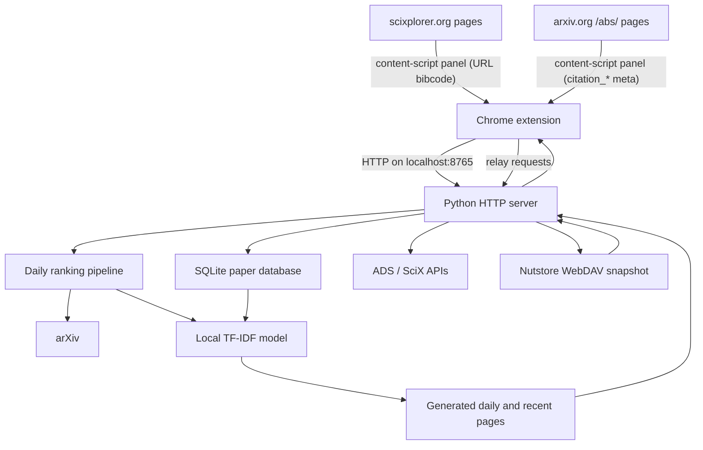

# How ArXistant works

ArXistant is a local web application paired with a Chrome extension. Chrome
provides reminders and navigation; Python performs network access, storage,
ranking, and page generation.

## System architecture



The server binds to `localhost`, not a public network interface. Generated
pages and JSON APIs are available only through the local machine unless the
network configuration is deliberately changed.

## Chrome extension responsibilities

The Manifest V3 extension contains:

- A popup for server status and page navigation.
- An options page for reminder times, weekend behavior, server URL, model
  retraining threshold, cloud sync, the ADS / SciX token, LLM settings, and a
  per-site on/off switch for the browsing panel.
- A background service worker for alarms, notifications, and automatic daily
  refresh requests. It also relays the page panels' requests to the local
  server.
- Content scripts that show an "add to ArXistant" panel on paper pages of two
  third-party sites — the project's only third-party-page injection. One shared
  module (`content-panel.js`) implements the panel; each site supplies a thin
  adapter that says how to read the paper's identity and metadata:
  - `https://scixplorer.org/*` — scixplorer.org is an AWS-WAF-protected React
    SPA, so the Python server cannot fetch its pages. The adapter reads the ADS
    bibcode from the URL (never from the page's own markup), tolerating the
    sub-page segments the site appends (`/abstract`, `/citations`, `/metrics`,
    …), and resolves metadata through the server's `/api/scix/resolve`. Because
    it is an SPA, the panel polls the pathname and re-attaches if the site
    replaces the DOM.
  - `https://arxiv.org/abs/*` — scoped to abstract pages only, so the script
    never loads on list or search pages. arXiv is server-rendered, so no
    polling is needed. The adapter reads the page's `citation_*` metadata
    (title, authors, abstract, DOI, date, arXiv ID), which is complete, so this
    path needs no ADS token and makes no arXiv API call — keeping it clear of
    arXiv's rate limiter. The version suffix is stripped so the key matches the
    daily list. It needs no `host_permissions` entry, since a declared content
    script requires only its match pattern.

  In both cases all server access goes through the service worker, so
  page-level mixed-content and private-network restrictions never apply. The
  permissions are read-only; a redesign of either site can at most make the
  panel disappear, never break the page. Each site can be switched off
  independently from Settings → Paper Panel; the adapter's `settingKey` is
  checked before the panel touches the page, so a disabled site means no
  polling, no requests and no DOM changes at all. Both default to on,
  including for settings stored before the toggle existed.
- A macOS custom-URL launcher integration. Linux relies on its systemd user
  service instead.

Each configured reminder is a one-shot Chrome alarm. After it fires, the
service worker schedules the next local-calendar occurrence. This avoids
daylight-saving drift. Startup recovery preserves overdue alarms so Chrome can
deliver reminders missed while the browser or computer was unavailable.

The first eligible reminder each day sends `POST /api/refresh-daily`. A date
stored in Chrome local storage prevents more than one successful automatic
refresh per day. Later reminders can retry if the first request failed.

## Local server responsibilities

`src/arxiv_db_server.py` uses Python's standard HTTP server and exposes pages
and JSON endpoints. It:

- Initializes and queries the SQLite database.
- Serves daily, recent, saved-paper, publication, search, chat, and model pages.
- Starts refresh and training subprocesses with the same Python interpreter.
- Calls arXiv and ADS APIs with bounded retries and backoff, so transient
  failures recover on their own and rate limits (HTTP 429) surface as clear
  messages after the provider's `Retry-After` hint is respected.
- Proxies Chat questions to a configurable OpenAI-compatible LLM endpoint and
  streams the answer back as server-sent events. It also downloads paper full
  text (arXiv HTML, falling back to ar5iv) on demand and caches it locally; the
  Chat page renders the HTML in a same-origin iframe so text can be selected
  and LLM-cited passages highlighted. The extension's Settings page reads and
  writes this LLM configuration through `/api/chat/config` and can test the
  saved credentials with a tiny provider request — the server stays the single
  place the key is stored (OS keychain when available).
- Stores model retraining state and launches training in a background thread.
- Serves paper-discovery endpoints (`/api/discover/*`): Semantic Scholar search
  and recommendations (keyless), the ADS citation graph and reviews/trending
  operators (token), TF-IDF similarity over the local library, and full-text
  search of cached papers. The chat assistant exposes these as callable tools
  (search_papers, search_library, find_related, citation_graph) alongside
  web_search; results are rendered in the conversation as clickable paper
  lists.
- Injects the shared save / tag / chat button scripts into the Daily, Recent,
  Saved Papers, and Search pages, so every paper card offers the same actions.
  The Daily and Recent pages additionally get the Listen script (pill, panel,
  and speech engine) at serve time.
- Serves the ⚙️ Settings page (`/settings.html`) with the three server-side
  settings surfaces in folded sections — the LLM (Chat + voice digests),
  Voice Reading, and Cloud Sync (the form is a shared section also used by
  the standalone `/cloud-sync.html`). It is the settings entry point for
  the Android app, which has no extension options page, and a fallback in
  any browser; everything it saves lives on that device's server.
- Resolves SciX papers: `GET /api/scix/resolve` maps an ADS bibcode or arXiv
  ID to a paper record through `api.scixplorer.org` (a public mirror of the
  ADS API sharing the same token), with bounded retries and exact-match
  validation. The saved-paper storage key follows one rule everywhere: the
  arXiv ID when the record has one, otherwise the bibcode. The key lives in
  the existing `saved_papers.arxiv_id` column, so the schema and the cloud
  sync format are unchanged, and a paper saved from the daily list by arXiv
  ID can never duplicate one saved from scixplorer by bibcode. `/api/save`
  additionally re-keys stray arXiv bibcodes as a guard.
- Serves the Chat reader for bibcode-keyed (journal-only) papers as a
  same-origin abstract card — selectable, highlightable, and marked so the
  Chat page's load-poll accepts it — instead of attempting an arXiv full-text
  fetch. The Chat page falls back to `/api/scix/resolve` when pinning a
  paper key that is neither in the library nor shaped like an arXiv ID.
- Stores and verifies the ADS / SciX token (`GET/POST /api/ads/token`,
  `POST /api/ads/token/test`) for the extension's Settings page; the token
  lives in the owner-only `ads_token.txt`.
- Produces spoken digests for the Daily/Recent **🔊 Listen** button
  (`GET /api/tts/summary?list=daily|recent&start=&count=`): it slices the
  ranked-list JSON snapshot, asks the Chat LLM to turn each paper's title,
  first author, and abstract into a short spoken-style paragraph (one
  request per batch, robustly parsed, falling back to reading the cleaned
  raw fields when no LLM is configured or the call fails), and caches the
  result per paper and model in `tts_summaries.json` so replays are
  instant. Titles are LaTeX-cleaned and the author count is reported so the
  page can announce each paper ("Paper 7. *Title*. By *author* and
  colleagues."). Voice settings are stored and served via
  `GET/POST /api/tts/config` — a voice *role* (system default / man /
  woman), papers per batch, and speaking rate — relayed by the extension's
  Settings page; every device resolves the role against its own
  speechSynthesis voices, preferring American English (Google's US English
  voice for the woman's role; a US system voice such as Alex or David for
  the man's, since Google ships no US English male voice), so the choice
  works across machines. Playback
  runs in the browser: sentence-chunked (avoiding Chrome's
  long-utterance stall), with a pause after each announcement and a short
  stop at the end of each paper, settings re-read on every batch so a
  change applies without a page reload, and a generation token so
  Stop/Skip can never leave stale utterance events or pending gaps behind.
  On Android the WebView has no speechSynthesis; the app exposes its
  native TextToSpeech engine through the ArxistantAndroid bridge
  (ttsSpeak/ttsStop plus completion callbacks), the same script drives it
  chunk by chunk with identical announcements and pauses, and the panel
  shows an inline voice / rate / batch-size row (POSTed to the same
  /api/tts/config) since the phone has no extension settings page.

Requests are handled on separate threads (a threading HTTP server) so a slow
or streaming LLM response cannot block the rest of the app.

`GET /api/health` reports whether the server is ready, its API compatibility
version, and which data directory it is using. The extension requires a matching
API version. On macOS, the launcher replaces a verified outdated ArXistant
process before starting the current server; it never stops an unrelated process
that happens to occupy port 8765.

## Ranking pipeline

The main ranker is `src/arxiv_daily_ranker_html.py`:

1. Fetch new or recent `astro-ph` submissions from arXiv using Python HTTPS.
2. Parse paper identifiers, titles, authors, and abstracts.
3. Load the current model and custom keywords.
4. Score and sort the papers.
5. Generate an HTML page with abstracts and local save controls, and write a
   JSON snapshot of the ranked list next to it. The Chat page reads these
   snapshots to offer daily/recent papers.

The recent view covers approximately five days. The daily view represents the
current arXiv release page.

## Machine-learning model

`src/arxiv_ml_ranker.py` trains a logistic-regression classifier over TF-IDF
text features.

| Component | Behavior |
|---|---|
| Positive samples | Papers saved by the user |
| Negative samples | Random recent arXiv papers, up to a 2:1 negative/positive ratio |
| Input text | Cleaned title and abstract |
| Features | Unigrams and bigrams, up to 10,000 features |
| Weighting | Sublinear term frequency with adaptive document-frequency bounds |
| Classifier | Logistic regression |

Training also estimates feature stability using 30 stratified subsamples. The
feature inspector favors consistently selected terms rather than presenting a
single training run as definitive.

Manual positive and negative keywords adjust model log-odds after the
classifier score. This gives the user an understandable override without
changing the fitted model.

## Model lifecycle

Saving or removing a paper increments a persistent change counter. When the
configured threshold is reached, the server launches training in a background
thread. The worker:

1. Trains and writes the model, vectorizer, and stability information.
2. Regenerates the ML Features page.
3. Subtracts only the changes included in that run.

Consequently, changes made while training remain queued. Failed runs preserve
the count so they can be retried.

## Data storage

Repository installations default to `local/`. Packaged installations set
`ARXISTANT_DATA_DIR` so writable state is outside the read-only application
directory. Debian/Ubuntu normally uses `~/.local/share/arxistant`.

Important data includes:

```text
arxiv_papers.db                 SQLite papers, publications, tags, highlights
ads_token.txt                   Optional ADS API token
scix_config.json                SciX library configuration
chat_config.json                Chat LLM base URL, model, temperature
tts_config.json                 Voice-reading settings (voice, batch, rate)
tts_summaries.json              Cached spoken digests per paper and model
pdf/                            Bounded LRU cache of arXiv PDFs (on demand)
local_documents/                Dropped-in PDFs with extracted text and chunks
fulltext/                       Cached paper full-text HTML for the Text view
cloud/config.json               Cloud sync settings (no secrets)
arxiv_ranked_personalized.html  Generated daily page
arxiv_recent_personalized.html  Generated recent page
ml_features.html                Generated model inspector
ml_ranker/
├── model.pkl
├── vectorizer.pkl
├── feature_stability.json
├── retrain_state.json
├── custom_positive.json
└── custom_negative.json
```

The Nutstore WebDAV app password is never written to the data directory; it
lives in the operating-system keychain via `keyring`. The Chat LLM API key is
kept in the owner-only (chmod-600) `chat_config.json` — the reliable store when
the server runs as a detached background daemon — with a best-effort keychain
copy that a freshly saved key overrides.

The data directory can be overridden manually with the
`ARXISTANT_DATA_DIR` environment variable. `ARXISTANT_PORT` changes the server
port, although the Chrome extension must then be configured with the matching
URL and host permission.

## ADS and SciX integration

SciX publication import extracts the library identifier from a shared library
URL, retrieves its bibcodes, and batch-fetches full metadata through NASA ADS.
ADS search uses the same token, applies the storage-key rule (arXiv ID when
the record has one, else bibcode), and gains save/tag/chat buttons for
journal-only records. The scixplorer.org paper panel resolves bibcodes through
`api.scixplorer.org` with the identical token, which the extension's Settings
page can save and verify. The token remains in the local data directory.

Imported publications are deduplicated by bibcode, normalized title, and arXiv
ID before insertion into SQLite.

## Cloud sync

Cloud sync is optional and local-first. The server exports the paper database
(saved papers, publications, and custom keywords) to a versioned JSON snapshot,
uploads it to a provider, and merges remote snapshots back in using per-record
`updated_at` timestamps (last-write-wins) plus deletion tombstones.

The default provider is Nutstore over WebDAV (`https://dav.jianguoyun.com/dav/`),
authenticated with the account email and a dedicated app password. The password
is stored in the operating-system keychain via `keyring` — never in
`config.json` or any other file. A second provider writes the same snapshot into
a local folder so the user can carry it with Dropbox/iCloud/OneDrive or the
Nutstore desktop app.

Saving or deleting a paper stamps a timestamp or tombstone and schedules a
debounced sync when enabled; a manual **Connect** and a sync at server startup
are also available. The ML model and generated pages are not synced — each
device retrains from its local copy of the shared database.

## Platform startup

### macOS

The helper application registers `arxistant://`. Chrome opens that URL when the
user clicks the popup's footer power button (shown as **Start Server** when the
server is offline), and the helper invokes `start_server.sh`. On Apple Silicon
the script explicitly starts ARM64 Python, and the server also forces its worker
subprocesses to ARM64 so they match the installed NumPy wheels. The same footer
button reads **Stop Server** when the server is running.

### Debian and Ubuntu

The package installs `/usr/bin/arxistant-server` and a systemd user unit. The
wrapper selects the XDG-compatible data directory before starting the installed
Python source from `/usr/lib/arxistant`.

### Windows and other platforms

The same Python server works when started manually. Native automatic startup
and installers have not yet been implemented.

### Android

An Android app (in the `android/` directory) embeds the Python server with
Chaquopy, runs it in-process on `127.0.0.1:8765`, and shows the pages in a
WebView. The same `arxistant_tasks` and `arxistant_secrets` modules are used,
but tasks run in-process and secrets are stored via an Android Keystore backend.
On Android the server injects a mobile menu (a floating ⋯ button replacing the
desktop nav), enables pull-to-refresh with a sync-first refresh, and runs
periodic Nutstore auto-sync every 30 minutes. See the
[Android app guide]({{ '/android/' | relative_url }}).

## Repository structure

```text
ArXistant/
├── chrome-extension/          Chrome UI, alarms, notifications, the settings
│                              page (server, reminders, retraining, cloud
│                              sync, LLM, voice reading, debug — folded
│                              sections), and the scixplorer.org / arxiv.org
│                              page panels
├── docs/                      User and technical documentation
├── packaging/linux/           Debian builder, launcher, and systemd unit
├── src/
│   ├── arxistant_cloud_providers.py
│   ├── arxistant_paths.py     Shared application/data paths
│   ├── arxistant_secrets.py   Keychain-backed secret storage
│   ├── arxistant_sync.py      Snapshot export/merge for cloud sync
│   ├── arxistant_tasks.py     In-process vs subprocess task dispatch
│   ├── arxiv_db_server.py     Local pages and JSON API
│   ├── arxiv_daily_ranker_html.py
│   ├── arxiv_ml_ranker.py
│   └── interest_generator.py
├── tests/                     Portability and feature regression tests
├── local/                     Git-ignored development data
├── requirements.txt
└── start_server.sh            macOS development launcher
```
