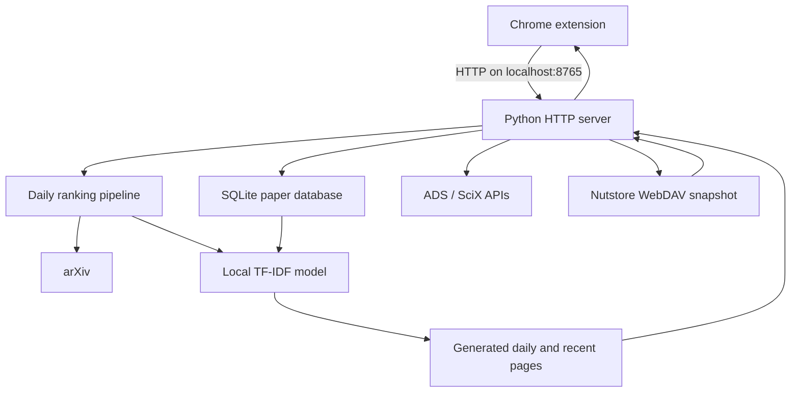

# How ArXistant works

ArXistant is a local web application paired with a Chrome extension. Chrome
provides reminders and navigation; Python performs network access, storage,
ranking, and page generation.

## System architecture



The server binds to `localhost`, not a public network interface. Generated
pages and JSON APIs are available only through the local machine unless the
network configuration is deliberately changed.

## Chrome extension responsibilities

The Manifest V3 extension contains:

- A popup for server status and page navigation.
- An options page for reminder times, weekend behavior, server URL, and model
  retraining threshold.
- A background service worker for alarms, notifications, and automatic daily
  refresh requests.
- A macOS custom-URL launcher integration. Linux relies on its systemd user
  service instead.

Each configured reminder is a one-shot Chrome alarm. After it fires, the
service worker schedules the next local-calendar occurrence. This avoids
daylight-saving drift. Startup recovery preserves overdue alarms so Chrome can
deliver reminders missed while the browser or computer was unavailable.

The first eligible reminder each day sends `POST /api/refresh-daily`. A date
stored in Chrome local storage prevents more than one successful automatic
refresh per day. Later reminders can retry if the first request failed.

## Local server responsibilities

`src/arxiv_db_server.py` uses Python's standard HTTP server and exposes pages
and JSON endpoints. It:

- Initializes and queries the SQLite database.
- Serves daily, recent, saved-paper, publication, search, and model pages.
- Starts refresh and training subprocesses with the same Python interpreter.
- Calls arXiv and ADS APIs.
- Stores model retraining state and launches training in a background thread.

`GET /api/health` reports whether the server is ready, its API compatibility
version, and which data directory it is using. The extension requires a matching
API version. On macOS, the launcher replaces a verified outdated ArXistant
process before starting the current server; it never stops an unrelated process
that happens to occupy port 8765.

## Ranking pipeline

The main ranker is `src/arxiv_daily_ranker_html.py`:

1. Fetch new or recent `astro-ph` submissions from arXiv using Python HTTPS.
2. Parse paper identifiers, titles, authors, and abstracts.
3. Load the current model and custom keywords.
4. Score and sort the papers.
5. Generate an HTML page with abstracts and local save controls.

The recent view covers approximately five days. The daily view represents the
current arXiv release page.

## Machine-learning model

`src/arxiv_ml_ranker.py` trains a logistic-regression classifier over TF-IDF
text features.

| Component | Behavior |
|---|---|
| Positive samples | Papers saved by the user |
| Negative samples | Random recent arXiv papers, up to a 2:1 negative/positive ratio |
| Input text | Cleaned title and abstract |
| Features | Unigrams and bigrams, up to 10,000 features |
| Weighting | Sublinear term frequency with adaptive document-frequency bounds |
| Classifier | Logistic regression |

Training also estimates feature stability using 30 stratified subsamples. The
feature inspector favors consistently selected terms rather than presenting a
single training run as definitive.

Manual positive and negative keywords adjust model log-odds after the
classifier score. This gives the user an understandable override without
changing the fitted model.

## Model lifecycle

Saving or removing a paper increments a persistent change counter. When the
configured threshold is reached, the server launches training in a background
thread. The worker:

1. Trains and writes the model, vectorizer, and stability information.
2. Regenerates the ML Features page.
3. Subtracts only the changes included in that run.

Consequently, changes made while training remain queued. Failed runs preserve
the count so they can be retried.

## Data storage

Repository installations default to `local/`. Packaged installations set
`ARXISTANT_DATA_DIR` so writable state is outside the read-only application
directory. Debian/Ubuntu normally uses `~/.local/share/arxistant`.

Important data includes:

```text
arxiv_papers.db                 SQLite papers and publications
ads_token.txt                   Optional ADS API token
scix_config.json                SciX library configuration
cloud/config.json               Cloud sync settings (no secrets)
arxiv_ranked_personalized.html  Generated daily page
arxiv_recent_personalized.html  Generated recent page
ml_features.html                Generated model inspector
ml_ranker/
├── model.pkl
├── vectorizer.pkl
├── feature_stability.json
├── retrain_state.json
├── custom_positive.json
└── custom_negative.json
```

The Nutstore WebDAV app password is not stored in this directory; it lives in
the operating-system keychain via `keyring`.

The data directory can be overridden manually with the
`ARXISTANT_DATA_DIR` environment variable. `ARXISTANT_PORT` changes the server
port, although the Chrome extension must then be configured with the matching
URL and host permission.

## ADS and SciX integration

SciX publication import extracts the library identifier from a shared library
URL, retrieves its bibcodes, and batch-fetches full metadata through NASA ADS.
ADS search uses the same token. The token remains in the local data directory.

Imported publications are deduplicated by bibcode, normalized title, and arXiv
ID before insertion into SQLite.

## Cloud sync

Cloud sync is optional and local-first. The server exports the paper database
(saved papers, publications, and custom keywords) to a versioned JSON snapshot,
uploads it to a provider, and merges remote snapshots back in using per-record
`updated_at` timestamps (last-write-wins) plus deletion tombstones.

The default provider is Nutstore over WebDAV (`https://dav.jianguoyun.com/dav/`),
authenticated with the account email and a dedicated app password. The password
is stored in the operating-system keychain via `keyring` — never in
`config.json` or any other file. A second provider writes the same snapshot into
a local folder so the user can carry it with Dropbox/iCloud/OneDrive or the
Nutstore desktop app.

Saving or deleting a paper stamps a timestamp or tombstone and schedules a
debounced sync when enabled; a manual **Connect** and a sync at server startup
are also available. The ML model and generated pages are not synced — each
device retrains from its local copy of the shared database.

## Platform startup

### macOS

The helper application registers `arxistant://`. Chrome opens that URL when the
user clicks the popup's footer power button (shown as **Start Server** when the
server is offline), and the helper invokes `start_server.sh`. On Apple Silicon
the script explicitly starts ARM64 Python, and the server also forces its worker
subprocesses to ARM64 so they match the installed NumPy wheels. The same footer
button reads **Stop Server** when the server is running.

### Debian and Ubuntu

The package installs `/usr/bin/arxistant-server` and a systemd user unit. The
wrapper selects the XDG-compatible data directory before starting the installed
Python source from `/usr/lib/arxistant`.

### Windows and other platforms

The same Python server works when started manually. Native automatic startup
and installers have not yet been implemented.

### Android

An Android app (in the `android/` directory) embeds the Python server with
Chaquopy, runs it in-process on `127.0.0.1:8765`, and shows the pages in a
WebView. The same `arxistant_tasks` and `arxistant_secrets` modules are used,
but tasks run in-process and secrets are stored via an Android Keystore backend.
See the [Android app guide](android.html).

## Repository structure

```text
ArXistant/
├── chrome-extension/          Chrome UI, alarms, notifications, settings
├── docs/                      User and technical documentation
├── packaging/linux/           Debian builder, launcher, and systemd unit
├── src/
│   ├── arxistant_paths.py     Shared application/data paths
│   ├── arxiv_db_server.py     Local pages and JSON API
│   ├── arxiv_daily_ranker_html.py
│   ├── arxiv_ml_ranker.py
│   └── interest_generator.py
├── tests/                     Portability regression tests
├── local/                     Git-ignored development data
├── requirements.txt
└── start_server.sh            macOS development launcher
```
